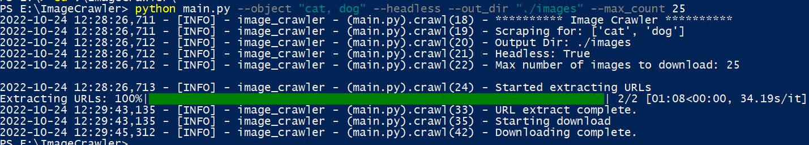

# Image Crawler
Multi-threaded tool to download images from the internet.

## Table of Contents
* [General Info](#general-information)
* [Features](#features)
* [Screenshots](#screenshots)
* [Setup](#setup)
* [Usage](#usage)
* [Room for Improvement](#room-for-improvement)
* [Contact](#contact)
* [License](#license)
* [Disclaimer](#disclaimer)


## General Information
- This project crawls the images from the Google search engine based on the objects specified.
- This tool helps to scrape the images required for your model building, reducing the manual efforts.


## Features
- You can specify the output directory
- Runs in both headless and head mode
- You can specify the number of images to download
- You can specify the maximum number of google suggestions to use
- You can specify the maximum workers to use for ThreadPool


## Screenshots



## Setup
Clone this repo using
```sh
git clone https://github.com/Anil-45/ImageCrawler.git
```

Install the required modules using
```sh
pip install -r requirements.txt
```


## Usage
- `--object`  Specify comma seperated strings to search for
- `--out_dir` Specify output directory(default: ./images)
- `--headless` Run with or without web driver GUI open
- `--max_count` Maximum number of images to download(default: `DEFAULT_IMG_COUNT`)

Example to run in background:

```bash
python main.py --object "cat, dog" --headless --out_dir "./images"  --max_count 25
```

Example to run in foreground:

```bash
python main.py --object "cat, dog" --out_dir "./images"  --max_count 25
```

You can configure more parameters using `constants.py`

`DEFAULT_IMG_COUNT = 50` specifies the number of images to download.
`MAX_WORKERS = 50` specifies maximum workers to use for ThreadPool.
`MAX_SUGGESTIONS = 25` specifies the number of URL suggestions by Google to be used. If you are trying to download a large number of images, keep this value high.

You can find the logs in `image_crawler.log`
## Room for Improvement
- Add user interface

## Contact
Created by [@Anil_Reddy](https://github.com/Anil-45/) 

## License
This project is available under the [MIT](https://github.com/Anil-45/ImageCrawler/blob/main/LICENSE).

## Disclaimer
This tool downloads the images shown based on Google ranking. Some of them may be subject to copyright. Please be aware while using them.